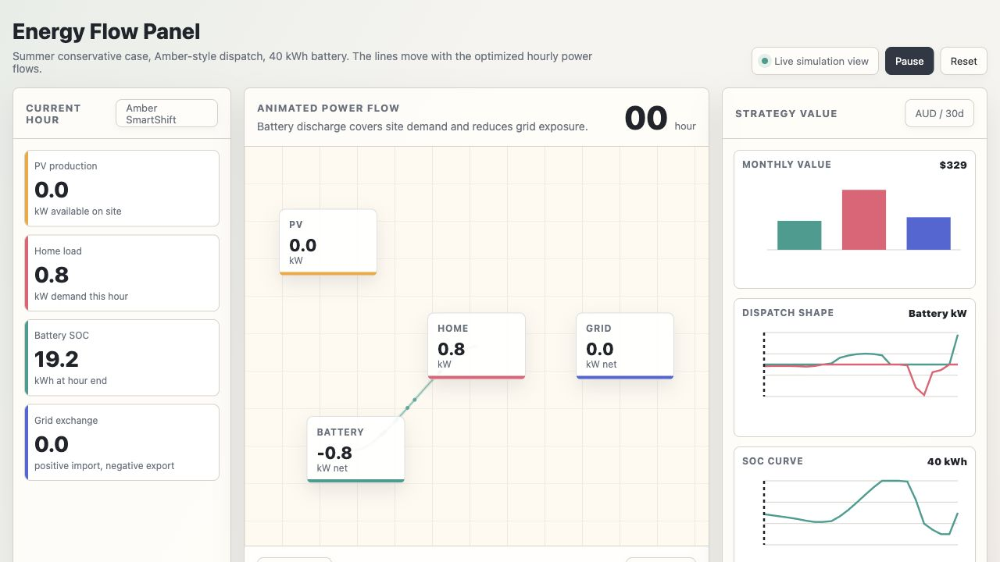

# Battery Arbitrage and VPP Simulator

This repository is a learning project for battery optimization, home energy management, and VPP revenue modelling.

It contains three progressively richer tools:

1. `battery_optimizer.py`: a minimal 24-hour battery arbitrage optimizer
2. `mini_emhass.py`: a compact EMHASS-inspired home energy scheduler
3. `amber_vpp_simulator.py`: a simulator comparing Home Assistant, Amber-style wholesale pricing, and traditional VPP programs
4. `energy_flow_panel.html`: a local animated dashboard panel for the simulated dispatch results

The project uses [Pyomo](https://www.pyomo.org/) for optimization and [HiGHS](https://highs.dev/) as the open-source LP/MILP solver.

## Repository Structure

```text
battery_optimizer/
├── battery_optimizer.py       # Minimal battery arbitrage model
├── mini_emhass.py             # PV/load/battery/grid home EMS optimizer
├── amber_vpp_simulator.py     # Amber / VPP / Home Assistant revenue simulator
├── energy_flow_panel.html     # Animated local dashboard panel
├── energy_flow_panel_preview.png
├── config_mini_emhass.json    # Mini-EMHASS configuration
├── requirements.txt           # Python dependencies
├── outputs/                   # Amber/VPP simulator outputs
├── schedule.csv               # Output from battery_optimizer.py
├── results.png                # Plot from battery_optimizer.py
├── mini_emhass_schedule.csv   # Output from mini_emhass.py
├── mini_emhass_results.png    # Plot from mini_emhass.py
├── mini_emhass_action.json    # Home Assistant style action payload
├── README.md                  # English README
└── README.zh-CN.md            # Chinese notes
```

## Quick Start

```bash
cd battery_optimizer
python3 -m venv venv
source venv/bin/activate
pip install -r requirements.txt
```

Run the minimal battery arbitrage optimizer:

```bash
python battery_optimizer.py
```

This prints the 24-hour optimal schedule and generates:

- `schedule.csv`
- `results.png`

## Tool 1: Battery Arbitrage Optimizer

`battery_optimizer.py` solves a 24-hour battery dispatch problem.

Scenario:

- Battery capacity: `10 kWh`
- Maximum charge power: `5 kW`
- Maximum discharge power: `5 kW`
- Initial SOC: `5 kWh`
- Time step: `1 hour`
- Objective: maximize arbitrage revenue from a simulated time-of-use price profile

The optimization model is a linear program:

```text
maximize sum_t price[t] * (p_dis[t] - p_ch[t]) * dt
```

Subject to:

```text
soc[t+1] = soc[t] + p_ch[t] * eta_charge * dt - p_dis[t] / eta_discharge * dt
soc[0]   = initial_soc
soc[24]  = initial_soc
0 <= soc[t] <= capacity
0 <= p_ch[t] <= p_charge_max
0 <= p_dis[t] <= p_discharge_max
```

The final SOC constraint makes the schedule cyclic. Without it, the optimizer would empty the battery at the end of the day and overstate the sustainable daily revenue.

## Tool 2: Mini-EMHASS

`mini_emhass.py` is a compact learning version of the core idea behind [EMHASS](https://github.com/davidusb-geek/emhass).

It models:

- PV forecast
- household base load forecast
- import electricity price
- export electricity price
- battery charge/discharge
- one deferrable load, such as EV charging or water heating
- grid import/export
- PV curtailment
- Home Assistant style action output

Run it:

```bash
python mini_emhass.py --current-hour 10
```

Generated files:

| File | Purpose |
|---|---|
| `mini_emhass_schedule.csv` | 24-hour optimized dispatch table |
| `mini_emhass_results.png` | Price, PV/load, SOC, grid flow, and cumulative savings chart |
| `mini_emhass_action.json` | One-hour control payload similar to a Home Assistant automation output |

Switch objective functions:

```bash
python mini_emhass.py --cost-function cost
python mini_emhass.py --cost-function profit
python mini_emhass.py --cost-function self-consumption
```

Objective meanings:

| Objective | Meaning |
|---|---|
| `cost` | Minimize the household energy bill |
| `profit` | Maximize negative cost / net value |
| `self-consumption` | Prioritize reducing grid exchange and PV curtailment |

Core power balance:

```text
grid_import + pv + battery_discharge
    = base_load + flexible_load + battery_charge + grid_export + pv_curtailment
```

This treats the home as a single energy bus. Every kW entering the bus must leave through some sink.

## Tool 3: Amber / VPP Revenue Simulator

`amber_vpp_simulator.py` turns the market discussion into a runnable engineering model.

It compares three operating strategies:

| Mode | Meaning |
|---|---|
| `self_ha` | Home Assistant + local optimizer controlling the battery |
| `amber_smartshift` | Amber-style wholesale-linked import/export pricing and SmartShift-like dispatch |
| `fixed_vpp` | Traditional VPP-style fixed participation credit plus optional event value |

Default run:

```bash
python amber_vpp_simulator.py
```

By default, it simulates:

- summer and winter
- `10 kWh`, `20 kWh`, and `40 kWh` batteries
- all three strategies
- a conservative normal-day price profile

Generated files:

| File | Purpose |
|---|---|
| `outputs/amber_vpp_summary.csv` | Summary by season, strategy, and battery size |
| `outputs/amber_vpp_dispatch.csv` | Hourly dispatch details |
| `outputs/amber_vpp_comparison.png` | Strategy comparison chart |
| `outputs/amber_vpp_best_schedule.png` | Detailed dispatch chart for the best simulated case |
| `outputs/amber_vpp_report.md` | Auto-generated interpretation report |

Run an event-day stress test:

```bash
python amber_vpp_simulator.py --volatility spiky
```

Run only one battery size:

```bash
python amber_vpp_simulator.py --capacities 40
```

Run only one strategy:

```bash
python amber_vpp_simulator.py --modes amber_smartshift
```

## Example Result

Using the default conservative simulation, the generated report selects:

```text
Season: summer
Mode: amber_smartshift
Battery: 40 kWh
Estimated value: 329.13 AUD / 30 days
```

This is not a tariff quote. It is a model output under the assumptions encoded in the script.

## Animated Energy Flow Panel

`energy_flow_panel.html` is a static local dashboard for the best conservative Amber-style case.

It shows:

- animated power flow between PV, home load, battery, and grid
- hourly SOC, PV, load, grid import/export, and battery setpoint
- monthly strategy value comparison
- dispatch and SOC mini charts
- conservative scenario ranking

Open it directly:

```bash
open energy_flow_panel.html
```

Or serve it locally:

```bash
python3 -m http.server 8010
```

Then open:

```text
http://127.0.0.1:8010/energy_flow_panel.html
```

Preview:



## Important Assumptions

The Amber/VPP simulator uses stylized price, PV, and load profiles.

It does not use live data from:

- Amber Electric
- AEMO / NEM
- Ausgrid, Endeavour, Essential, or other network providers
- Home Assistant
- a real smart meter
- a real inverter

The point is to provide a clean modelling framework first. For a real project, replace the simulated profiles with:

- AEMO/NEM price traces
- Amber import/export prices
- smart meter load data
- PV inverter telemetry
- battery SOC history
- real VPP program terms

## Why Some Models Are LP and Others Are MILP

The minimal battery arbitrage model can be solved as an LP because simultaneous charge and discharge is naturally unattractive when round-trip efficiency is below 100%.

The Amber/VPP simulator uses a small MILP because wholesale-linked export prices can create artificial import/export loops in a pure LP. Binary variables enforce realistic operating directions:

```text
is_importing[t] = 1  -> grid import allowed, export blocked
is_charging[t]  = 1  -> battery charge allowed, discharge blocked
```

The model is still tiny: 24 hours with two binary variables per hour.

## Dependencies

- Python 3.9+
- `pyomo`
- `highspy`
- `numpy`
- `pandas`
- `matplotlib`

Install all dependencies with:

```bash
pip install -r requirements.txt
```

## Notes

This is a learning and research project, not financial advice.

The most useful next step is to connect real market and device data, then compare the simulated dispatch with actual bills and inverter logs.
